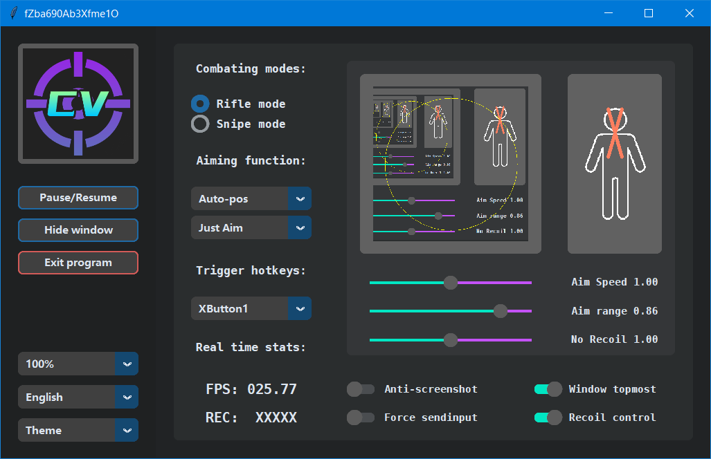
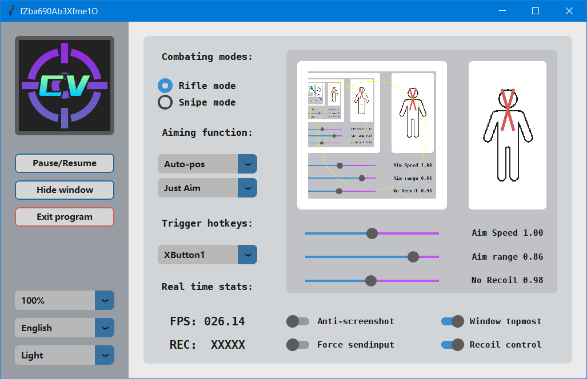

# **CVGO -.-....---.--- 𝐑𝐞𝐥𝐞𝐚𝐬𝐞**
## 𝒀𝑶𝑳𝑶𝒗 𝑽/𝑽𝑰/𝑽𝑰𝑰/𝑿 𝒃𝒂𝒔𝒆𝒅 𝒂𝒊𝒎 𝒂𝒔𝒔𝒊𝒔𝒕

## Note: 📖📖📖
* Must use the provided version of GHUB driver or older version (older than 2022.03), or use LGS instead, or use provided patch to reverse back GHUB version
* Password is in the INSTRUCTION channel of my discord server
* Don't include "ID: " or "KEY: " when entering...... But need to include that "key/" which is not capitalized

## Upcoming: 📆📆📆
* Using TRT to boost speed (done, planned to add only in pro version, done, evaluating)
* ~Using new "nice-looking" gui (Done)~
* ~Safer version which pure relies on python.exe (Done)~
* Hide process from task manager (Testing)
* Better weights for Valorant and PUBG (PUBG training now, Volarant next week, delayed)
* Accurate recoil control for some games (Done for CSGO, available only in pro version)
* Players can download at different time will get different files (with same file names but content changed)

## Promotion 📃📃📃
* Join our [new Discord](https://discord.gg/qkvkT7y7mZ) for password and free trial, where also provide a channel for development discussion
* AIMBOT IS NOT free, join the server for details
* There is a free weights shared previously for people who want to code their own program. Enjoy. (class 0: head; class 1: body)
* Also a slightly modified version of labelimg, with zoom up to 1000% and no fuzzy
* Proof of [work on YouTube](https://www.youtube.com/channel/UCyDKoZcyp2vDvskHFviRtag)
* 国内YOLO交流群 778907895 欢迎讨论各类技术问题

 ## Features 👍👍👍
* Different checksum for different user
* Light weight YOLO AIMBOT, fantastic performance (low GPU usage)
* Does not read/write memory, no virus and fill free to scan (except for ESET which take all packers as potential virus)
* Smooth human-like mouse move at all FPS values, random speed of mouse clicks
* Custom shortcut keys, custom mouse move speed, custom aiming positions, various supported games
* Enhanced object tracking using PID (optimized for both static and moving targets)
* Welcome to try with your secondary accounts to see if it can bypass anti-cheats. (I can show video proofs but it is better verify with your own eyes)
* External hardware (KMBOX) can be purchased at [Taobao](https://world.taobao.com/item/659201542143.htm)

 