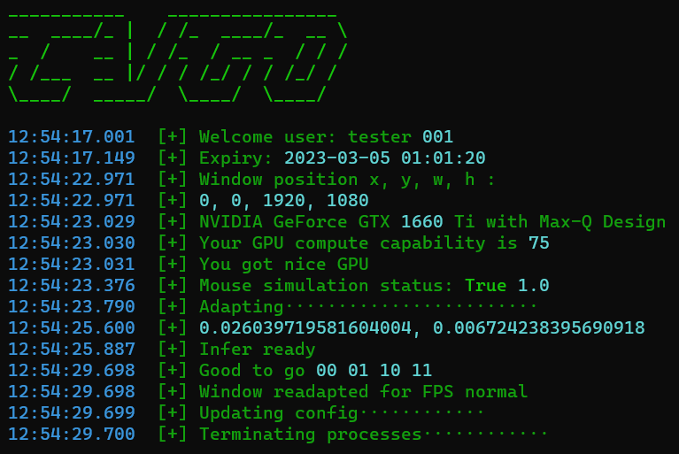

```
          _____                    _____                    _____                   _______         
         /\    \                  /\    \                  /\    \                 /::\    \        
        /::\    \                /::\____\                /::\    \               /::::\    \       
       /::::\    \              /:::/    /               /::::\    \             /::::::\    \      
      /::::::\    \            /:::/    /               /::::::\    \           /::::::::\    \     
     /:::/\:::\    \          /:::/    /               /:::/\:::\    \         /:::/~~\:::\    \    
    /:::/  \:::\    \        /:::/____/               /:::/  \:::\    \       /:::/    \:::\    \   
   /:::/    \:::\    \       |::|    |               /:::/    \:::\    \     /:::/    / \:::\    \  
  /:::/    / \:::\    \      |::|    |     _____    /:::/    / \:::\    \   /:::/____/   \:::\____\ 
 /:::/    /   \:::\    \     |::|    |    /\    \  /:::/    /   \:::\ ___\ |:::|    |     |:::|    |
/:::/____/     \:::\____\    |::|    |   /::\____\/:::/____/  ___\:::|    ||:::|____|     |:::|    |
\:::\    \      \::/    /    |::|    |  /:::/    /\:::\    \ /\  /:::|____| \:::\    \   /:::/    / 
 \:::\    \      \/____/     |::|    | /:::/    /  \:::\    /::\ \::/    /   \:::\    \ /:::/    /  
  \:::\    \                 |::|____|/:::/    /    \:::\   \:::\ \/____/     \:::\    /:::/    /   
   \:::\    \                |:::::::::::/    /      \:::\   \:::\____\        \:::\__/:::/    /    
    \:::\    \               \::::::::::/____/        \:::\  /:::/    /         \::::::::/    /     
     \:::\    \               ~~~~~~~~~~               \:::\/:::/    /           \::::::/    /      
      \:::\    \                                        \::::::/    /             \::::/    /       
       \:::\____\                                        \::::/    /               \::/____/        
        \::/    /                                         \::/____/                 ~~              
         \/____/                                                                               
```
# 𝒀𝑶𝑳𝑶𝒗 𝑽/𝑽𝑰/𝑽𝑰𝑰/𝑿 𝒃𝒂𝒔𝒆𝒅 𝒂𝒊𝒎 𝒂𝒔𝒔𝒊𝒔𝒕

* Dark theme

* Light theme


## Note: 📝📝📝
* Must use the provided version of GHUB driver or older version (older than 2022.03), or use LGS instead, or use provided patch to reverse back GHUB version
* **Password is located at the INSTRUCTION channel of my discord server**
* Don't include "ID: " or "KEY: " when entering...... But need to include that "key/" which is not capitalized

## Upcoming: 📆📆📆
* Using TRT to boost speed (done, planned to add only in pro version, done, evaluating)
* ~Using new "nice-looking" gui (Done)~
* ~Safer version which pure relies on python.exe (Done)~
* Support Arduino Leonardo + USB host shield (Done, under testing)
* Hide process from task manager (Done, under testing)
* Better weights for Valorant and PUBG (PUBG training now, Volarant next week, delayed)
* ~Accurate recoil control for some games (Done for CSGO, available only in pro version)~
* Players can download at different time will get different files (with same file names but content changed)

## Promotion 🎈🎈🎈
* Join our [new Discord](https://discord.gg/qkvkT7y7mZ) for **password** and free trial (one day), where also provide a channel for development discussion
* AIMBOT IS NOT free, join the server for details, but I will also release a free version
* There is a free weights shared previously for people who want to code their own program. Enjoy. (class 0: head; class 1: body, 416*416, Yolov4-tiny)
* Also a slightly modified version of labelimg, with zoom up to 1000% and no fuzzy
* Proof of [work on YouTube](https://www.youtube.com/channel/UCyDKoZcyp2vDvskHFviRtag)
* BE A PRO IN CSGO/CROSSFIRE/VALORANT/APEX/NZ & so on !!!
* QQ Group 778907895

## Features 👍👍👍
* Different checksum for different user
* One program works on many fps games
* Light weight YOLO AIMBOT, fantastic performance (low GPU usage)
* Well-trained models
* Does not read/write memory, no virus and fill free to scan (except for ESET which take all packers as potential virus)
* Smooth human-like mouse move at all FPS values, random speed of mouse clicks
* Custom shortcut keys, custom mouse move speed, custom aiming positions, various supported games
* Enhanced object tracking using PID (optimized for both static and moving targets)
* Support different types of mouse simulation to bypass ***
* Welcome to try with your secondary accounts

## External hardwares 💻💻💻
* External hardware (KMBOX) can be purchased at [Taobao](https://world.taobao.com/item/659201542143.htm)

* External hardware (Arduino Leonardo + USB host shield) can be purchased at [Amazon - Arduino Leonardo](https://www.amazon.com/KEYESTUDIO-Leonardo-Development-Board-Arduino/dp/B0786LJQ8K/) and [Amazon - USB host shield](https://www.amazon.com/ARCELI-Shield-Arduino-Support-Android/dp/B07J2KKGZ4/) or [Ebay - USB host shield](https://www.ebay.com/itm/393311967986)
* If you choose to use Arduino, be realize that you need to solder those three lacations 
